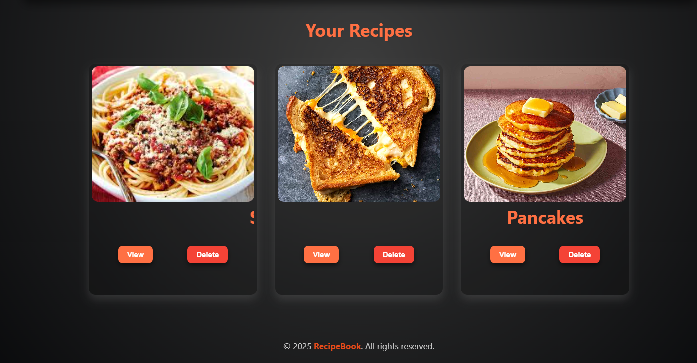
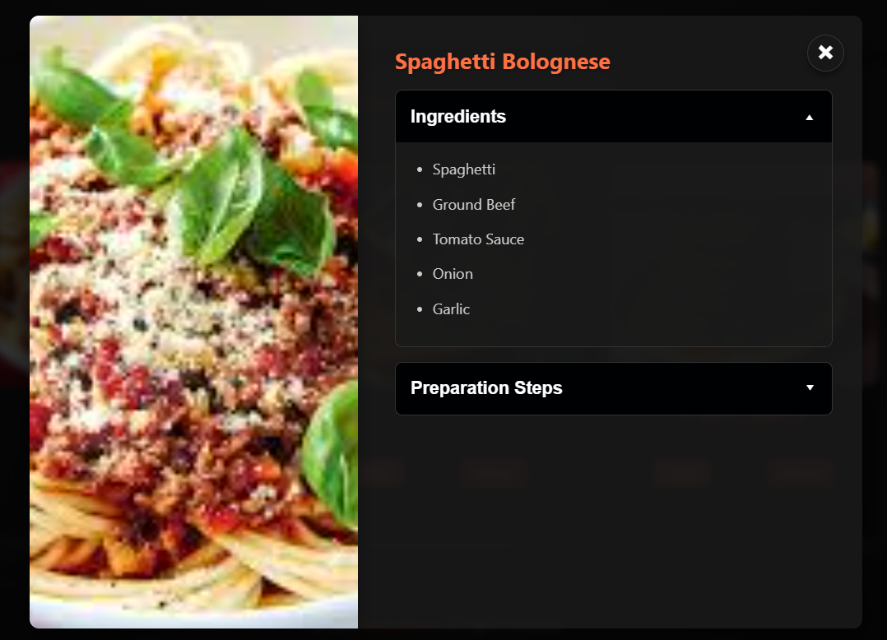
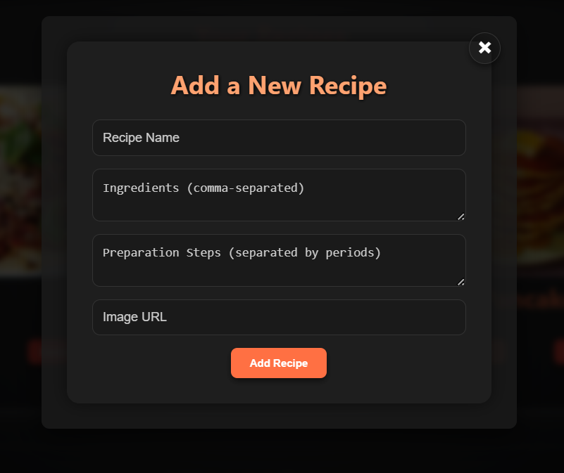

# Recipe Book

Welcome to your **Personal Recipe Book** – a beautiful, responsive web app where you can save, search, and manage your favorite recipes with ease.


---

## Features

- Add your own custom recipes with ingredients and preparation steps.
- Real-time search with smart suggestions as you type.
- Support for image URLs with fallback for broken links.
- Data is stored in **Local Storage** – your recipes persist even after refresh.
- Fully responsive and mobile-friendly design.
- Clean UI with modal support, blur background, and animations.
- Delete recipes with a single click.

---

## Tech Stack

- HTML5
- CSS3 with Flexbox, Media Queries, and CSS Variables
- JavaScript (ES6+)
- Vite for development and build

---

## Project Structure

Recipe-Book
- ├── index.html # Main HTML structure
- ├── main.js # Entry point 
- ├── components/ # All modular JS components 
- ├── styles/ # CSS files 
- ├── assets/ # Logo / images if any 
- └── README.md # This file


---

## Installation

1. Clone the repo:
   ```bash
   git clone https://github.com/Udit-kasana/Recipe-Book.git

2. Navigate to project directory:

    ```
    cd Recipe-Book
3. Install dependencies and start development server:

    ```
    npm install
    npm run dev

## Live Demo

Check out the live demo of this project: [Recipe Book](https://udit-kasana.github.io/Recipe-Book/)

## Navigation Guide

1. **Home Page**

   

2. **Recipes Section**

   

   - Navigate to the top-right corner and click on Add to add new Recipes.

   - Click on card view Button to view Full Recipe:
   - Click on ingredients to view ingrediants and - - Click Preparstion steps to view steps

   

   - Click on delete Button to delete the recipe from local storage

3. **Settings**

   - Click on the Add(in header) to Add recipes.
   - A form will appear add details and click on Add Recipe

   
